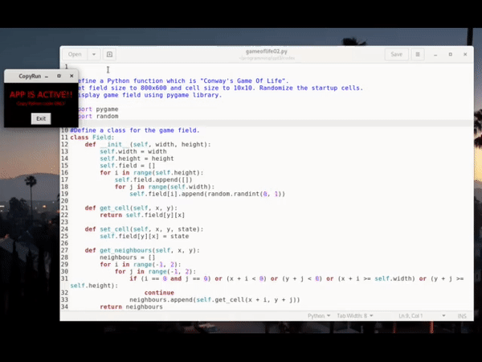

# CopyRun
## This program runs Python code which is copied in clipboard
  
WARNING!!
USE AT YOUR OWN RISK! NO GUARANTIES IF ANYTHING GETS BROKEN.
DO NOT COPY ANYTHING EXCEPT PYTHON CODE YOU HAVE REVIEWED!!
FOR EDUCATIONAL AND INFORMATIONAL PURPOSES ONLY.

This app automatically executes Python code after it is copied in clipboard.  
It saves the contents of the clipboard in file "testscript.py" and executes it. Saved code is located in the same directory as CopyRun.py program. It ONLY executes content which is different from previously copied content. The CopyRun app waits for the launched code to exit and then continues to work.  
At all times there should be a warning window visible, which indicates
that this app is active and running.  
While active, CopyRun writes status messages and launched program's output in terminal.
  

  
